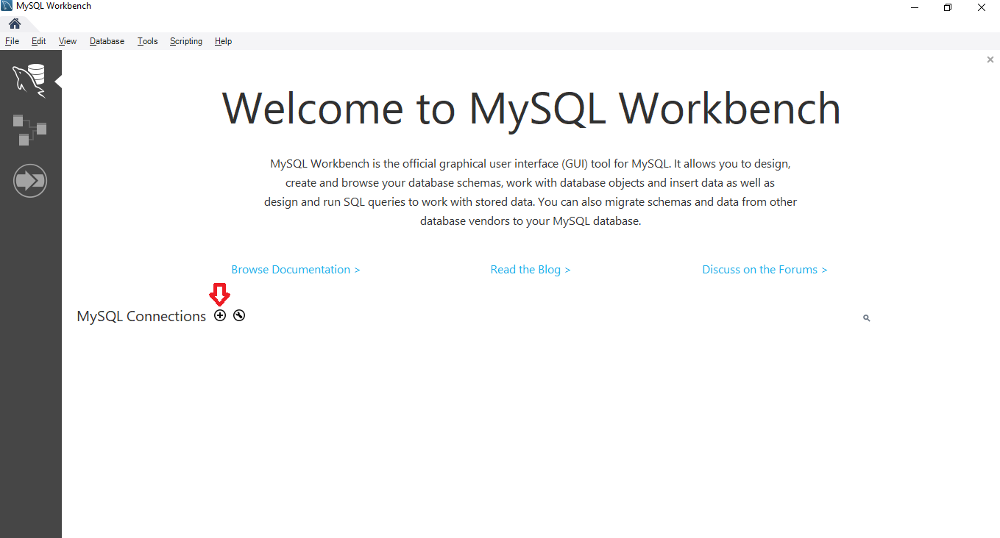
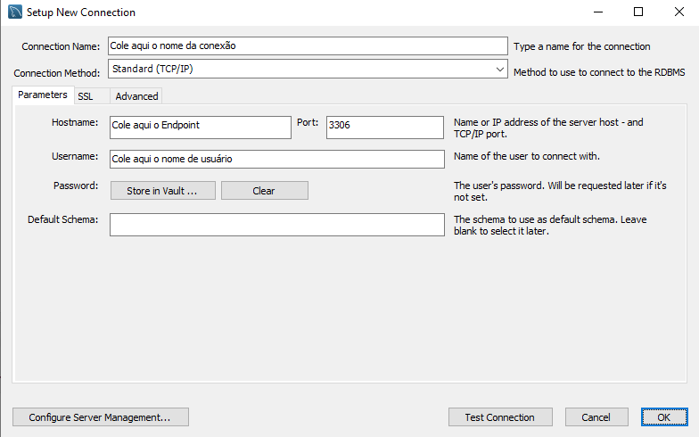
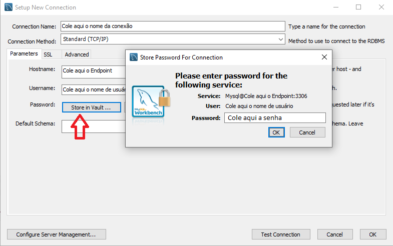
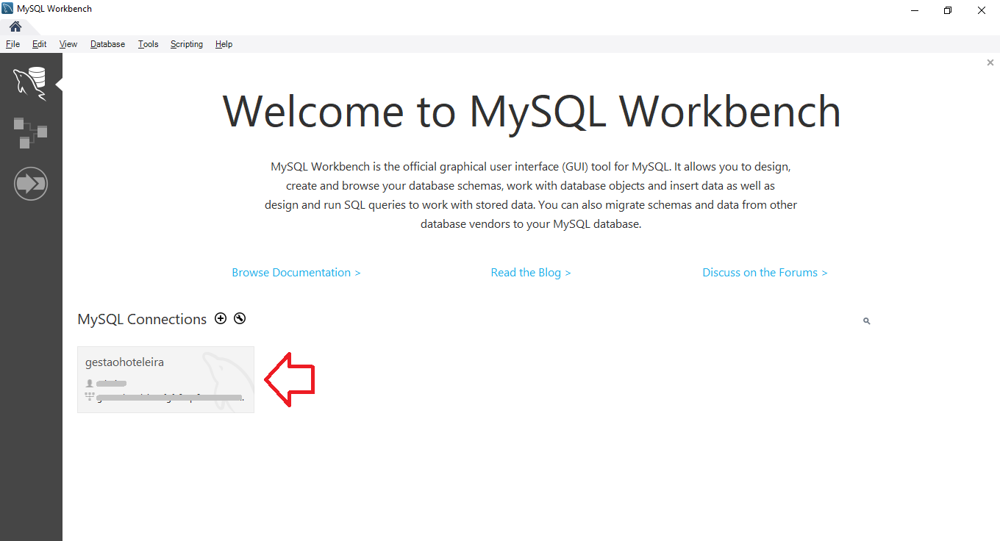
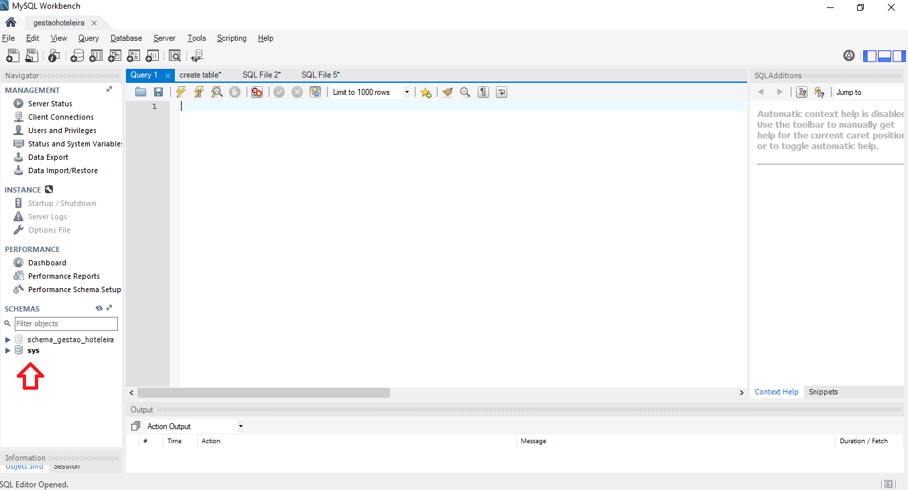

# Tutorial-Banco-de-Dados

## Tutorial para visualizar, modificar e testar o Banco de Dados.

### Pré-requisitos

- Ter o software MySQL WorkBench 8.0+ (ou qualquer outro software para acessar o Banco de dados MySQL);
- possuir acesso ao EndPoint da instância do Banco de Dados;
- Possuir as credenciais de acesso.

1. ##### Conectar ao Banco de Dados

- Criar uma nova conexão:

- Inserir os seguintes dados:

               

  

Ao finalizar, dê "OK" para criar a conexão. Após isto, basta acessar o Banco de Dados.

2. ##### Acessar o Banco de Dados

- Após a criação da conexão, na tela inicial do Workbench aparecerá:

  

  Dê um clique para conectar (Em alguns casos, o software irá requisitar a senha novamente).

- Caso não ocorra erro, a conexão foi bem sucedida!

  

Agora apenas selecione o schema e comece a alterar ou testar o BD. :D
